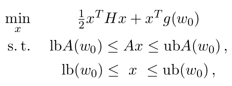

#### QPOASES使用

##### 1. 简介

[QPOASES](https://github.com/coin-or/qpOASES)是为解决MPC问题所编写的库，用户可将MPC问题转化为序列二次规划问题(SQP)后用该库进行求解，同时其也可以解决单独的QP优化问题。

##### 2. 使用

在构建QP问题时需要将其变为标准形式，如下图所示



与**QuadProgpp**不同的是其线性项是优化变量的转置乘系数，**QuadProgpp**为系数的转置乘优化变量。同时在**lb(lbA)=ub(unA)**时可以构建等式约束。

在使用时首先引入作用域

```c++
USING_NAMESPACE_QPOASES
```

后构建第一个QP问题

```c++
// 1. 构建QP问题
    QProblem example(2, 1); // 优化变量, 约束变量 维度

    // 2. 初始化第一个QP
    real_t H[2*2] = {1.0, 0.0, 0.0, 0.5}; // Hessian Matrix
    real_t A[1*2] = {1.0, 1.0};                    // 不等式/等式约束系数矩阵
    real_t g[2] = {1.5, 1.0};                      // 线性项系数 与maatlab不同为 x' * g
    real_t lb[2] = {0.5, -2.0};                    // x 下界
    real_t ub[2] = {5.0, 2.0};                     // x 上界
    real_t lbA[1] = {-1.0};                             // 不等式/等式上界 上下界相等时为等式约束
    real_t ubA[1] = {2.0};                              // 不等式/等式下界
```

其中在实例化QP问题时初始化参数依次为优化变量维数与约束个数。之后按照上图约定QP问题格式构建第一个QP问题。

若假设Hessian矩阵在序列QP中不变，可构造后续QP问题构建MPC。

```c++
// 初始化第二个QP(MPC) 假设 H A不变
    real_t g_new[2] = {1.0, 1.5};
    real_t lb_new[2] = {0.0, -1.0};
    real_t ub_new[2] = {5.0, -0.5};
    real_t lbA_new[1] = {-2.0};
    real_t ubA_new[1] = {1.0};
```

若Hessian矩阵在求解过程发生改变，可使用SQProblem构建 SQP问题

```c++
/* Setup data of first QP. */
	real_t H[2*2] = { 1.0, 0.0, 0.0, 0.5 };
	real_t A[1*2] = { 1.0, 1.0 };
	real_t g[2] = { 1.5, 1.0 };
	real_t lb[2] = { 0.5, -2.0 };
	real_t ub[2] = { 5.0, 2.0 };
	real_t lbA[1] = { -1.0 };
	real_t ubA[1] = { 2.0 };

	/* Setup data of second QP. */
	real_t H_new[2*2] = { 1.0, 0.5, 0.5, 0.5 };
	real_t A_new[1*2] = { 1.0, 5.0 };
	real_t g_new[2] = { 1.0, 1.5 };
	real_t lb_new[2] = { 0.0, -1.0 };
	real_t ub_new[2] = { 5.0, -0.5 };
	real_t lbA_new[1] = { -2.0 };
	real_t ubA_new[1] = { 1.0 };


	/* Setting up SQProblem object. */
	SQProblem example( 2,1 );
```

构建QP问题够可对求解进行设置

```c++
    Options options;
	options.setToMPC();
	options.printLevel = PL_LOW; // 打印调试输出设置为仅输出error状态
    example.setOptions(options);
```

在设置方面有三种默认构造选项

```c++
setToDefault( ) // 默认设置 
setToReliable( ) // 更加关注精度，求解速度降低
setToMPC( ) // 更加关注求解速度，精度降低
```

之后可设置最大求解迭代次数

```c++
int nWSR = 10;                                           // 最大迭代次数
```

最后便可以进行求解

```c++
	example.init(H, g, A, lb, ub, lbA, ubA, nWSR); // 求解

    // 4. 得到最优解
    real_t xOpt[2];
    real_t yOpt[2+1];
    example.getPrimalSolution(xOpt);
    example.getDualSolution(yOpt);
    std::cout<<"PrimalSolution: "<<xOpt[0]<<","<<xOpt[1]<<std::endl; // 原问题最优变量
    std::cout<<"DualSolution: "<<yOpt[0]<<","<<yOpt[1]<<yOpt[2]<<","<<std::endl; // 最优对偶变量(优化变量个数+约束个数)
    std::cout<<"ObjVal: "<<example.getObjVal()<<std::endl; // 目标函数值

    //解第二个QP问题
    nWSR = 10;
    example.hotstart(g_new, lb_new, ub_new, lbA_new, ubA_new, nWSR);
    example.getPrimalSolution(xOpt);
    example.getDualSolution(yOpt);
    std::cout<<"PrimalSolution: "<<xOpt[0]<<","<<xOpt[1]<<std::endl;
    std::cout<<"DualSolution: "<<yOpt[0]<<","<<yOpt[1]<<yOpt[2]<<","<<std::endl;
    std::cout<<"ObjVal: "<<example.getObjVal()<<std::endl;

    example.printOptions(); // 打印调试输出
```

